# Here are some screenshots for the Web Fundamentals Challenges.

---

# CSS Challenge

The 'Flag' challenge, the first image shows the initial state with the German and French flags, the second showing the hovered German - Hungarian flag and the clicked French - Irish flag

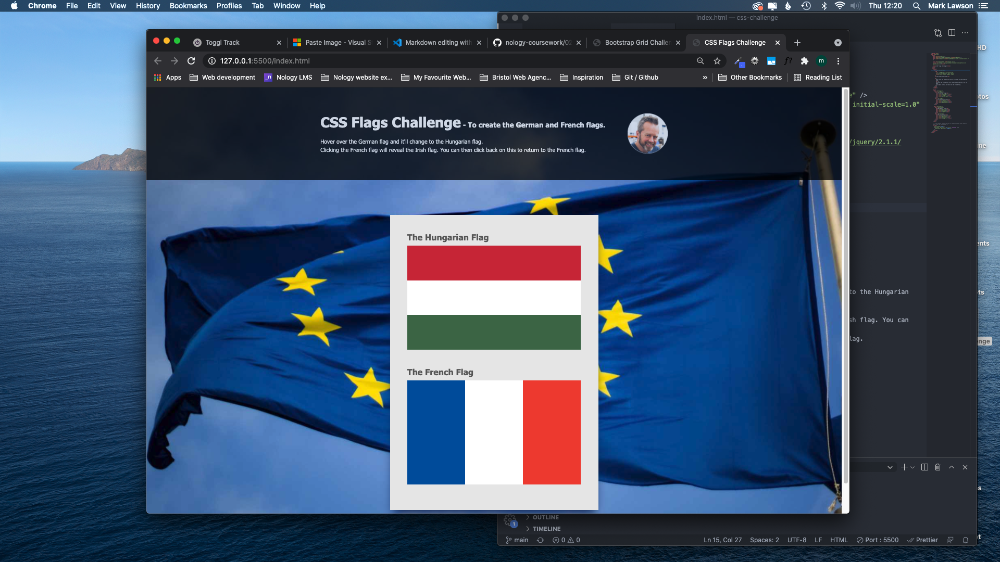

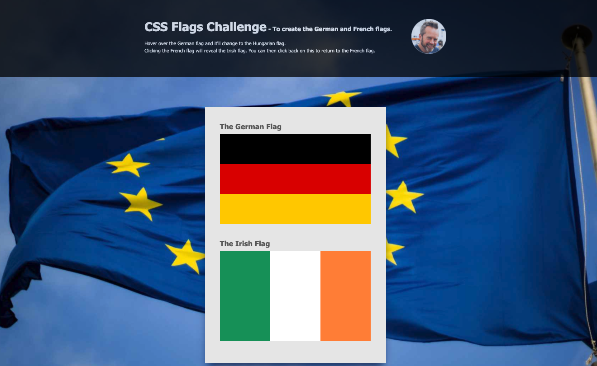

---

# UI Design / Prototyping Challenge

Link to my figma design for the Bear Bakery challenge

https://www.figma.com/file/IQIw4YRx7oRzGnyPwVv8Y9/Bear-Bakery-Mobile-Design?node-id=0%3A1

---

# Flexbox Challenge #1

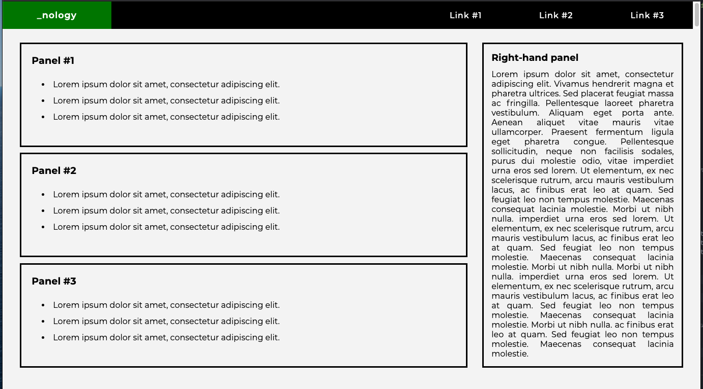

# Flexbox Challenge #2

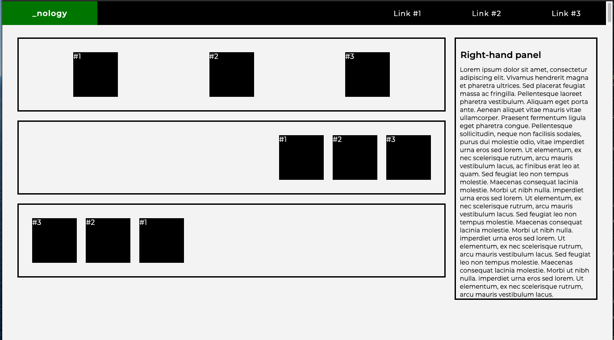

# Fundamentals Palace - Combined HTML,Flexbox and Font Awesome challenge

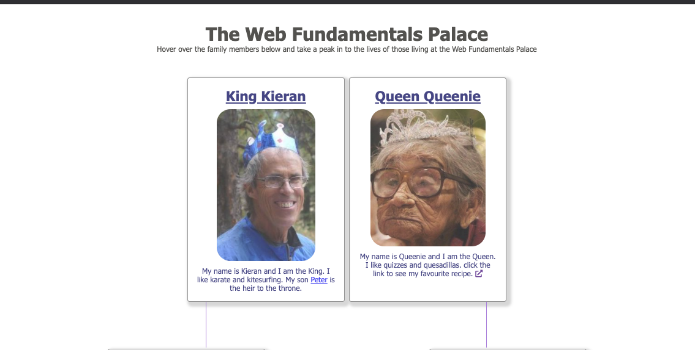
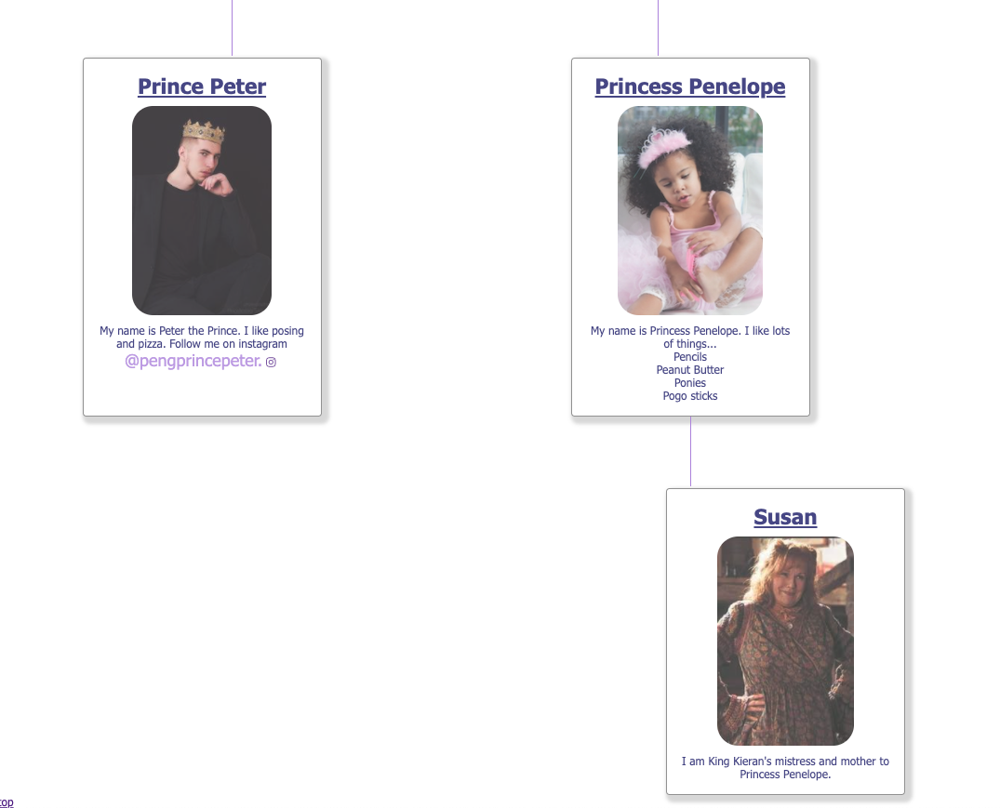

---

# SCSS - BEM Challenge

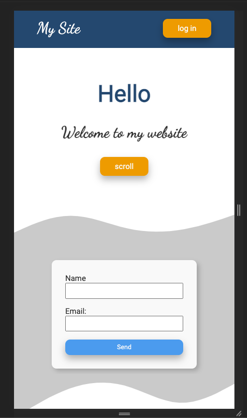
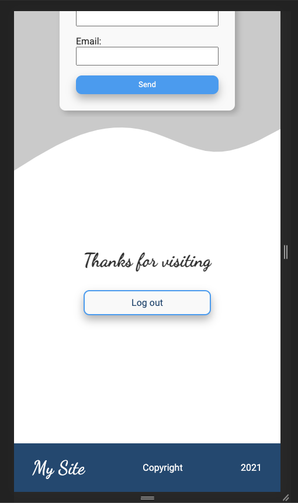

---

# CSS Grid Challenge

## 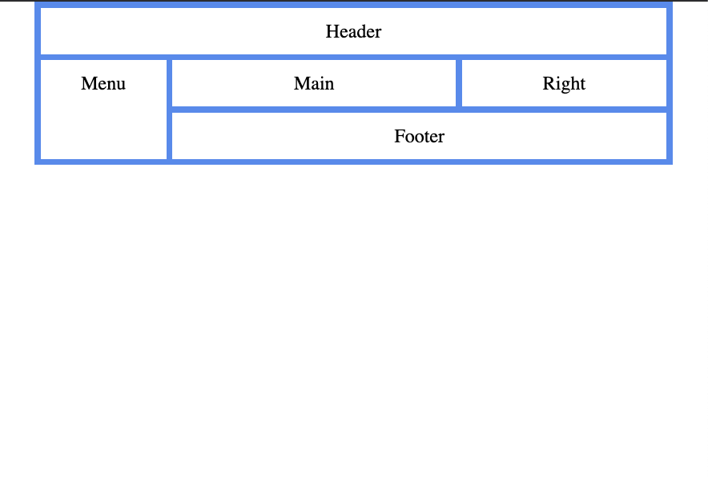

# Bootstrap Challenge

Desktop layout

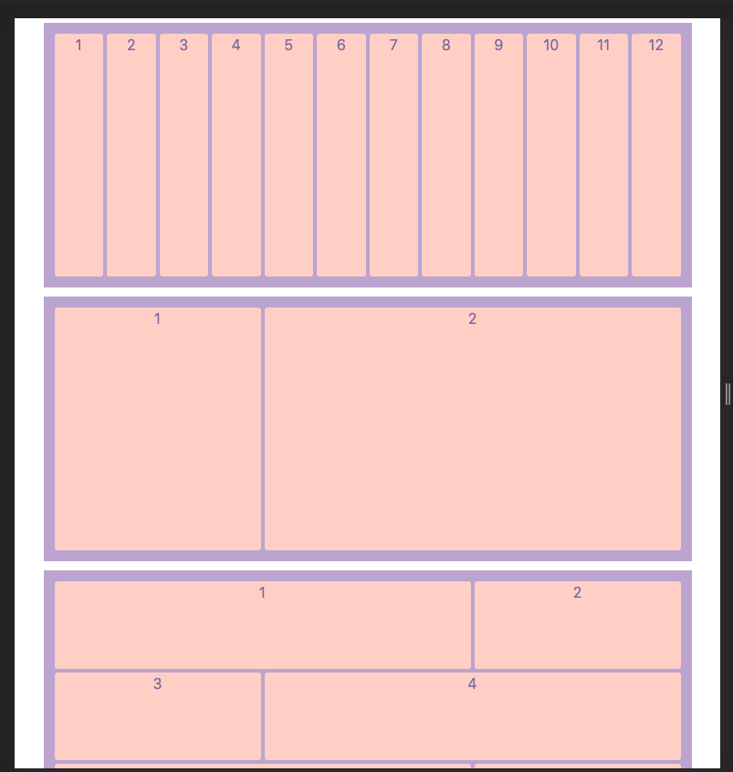
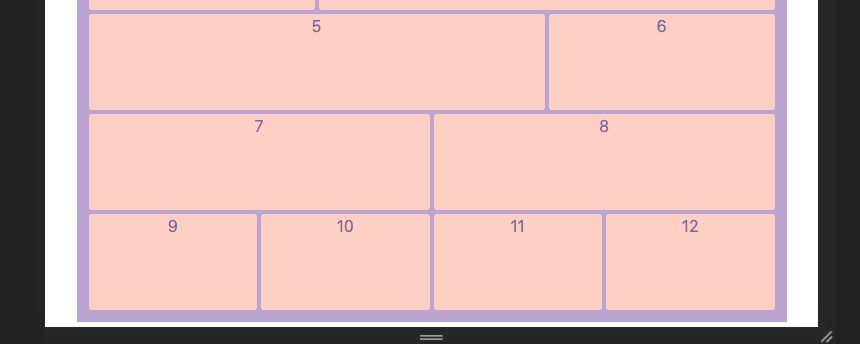

Mobile layout

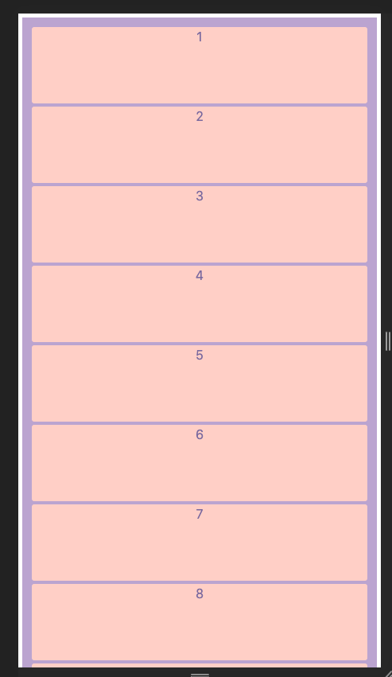
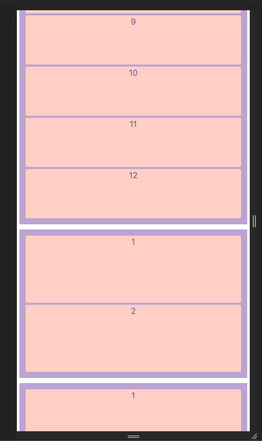
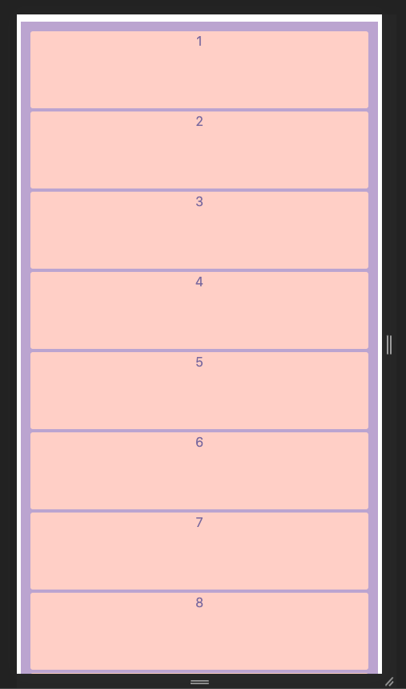
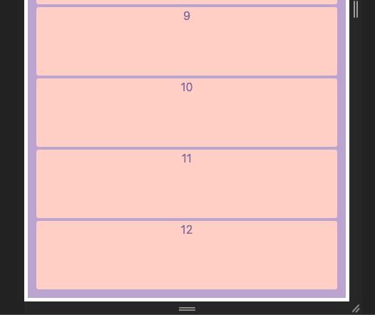

---

# Portfolio Challenge

Here's a link to my portfolio site ---
https://walkonmars36.github.io/portfolio/
